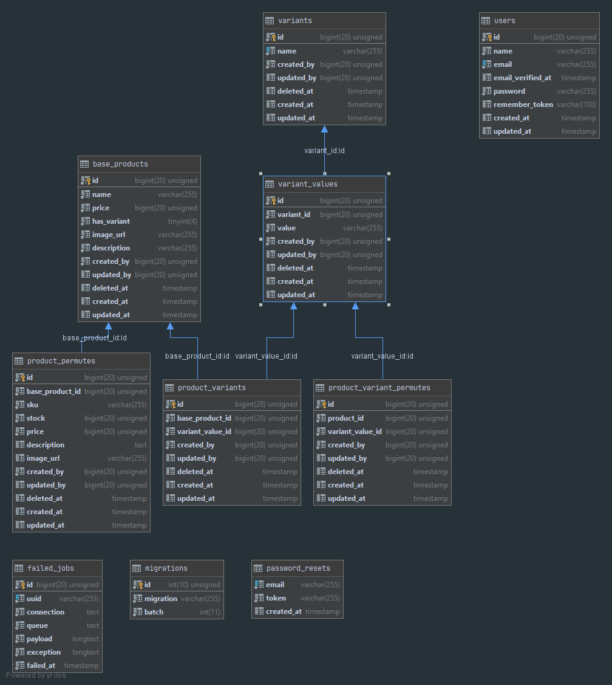

# SKU Generator

## What is SKU?
A SKU (Stock Keeping Unit) is a distinct type of item for sale such as a product or service, and all attributes
  associated with the item type that distinguish it from other item types. For a product, these attributes can include manufacturer, description, material, size, color, packaging, and warranty terms. 

## About Project
Used in inventory management, the application allows the admin to create products with their vairants and also
 generate all the possible permutation of the variants i.e the Cartisan product of the variants.

## Getting started

## Installation

Clone the repository

    git clone https://github.com/harsh-kukreja/product-sku-generator.git

Switch to the repo folder

    cd product-sku-generator

Install all the dependencies using composer

    composer install

Copy the example env file and make the required configuration changes in the .env file

    cp .env.example .env

Generate a new application key

    php artisan key:generate

Generate Storage link

    php artisan storage:link
    
 Run the database migrations (**Set the database connection in .env before migrating**)
 
     php artisan migrate:fresh --seed
 
 Start the local development server
 
     php artisan serve
 
 You can now access the server at http://localhost:8000
 
 
## Database Schema

